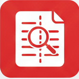
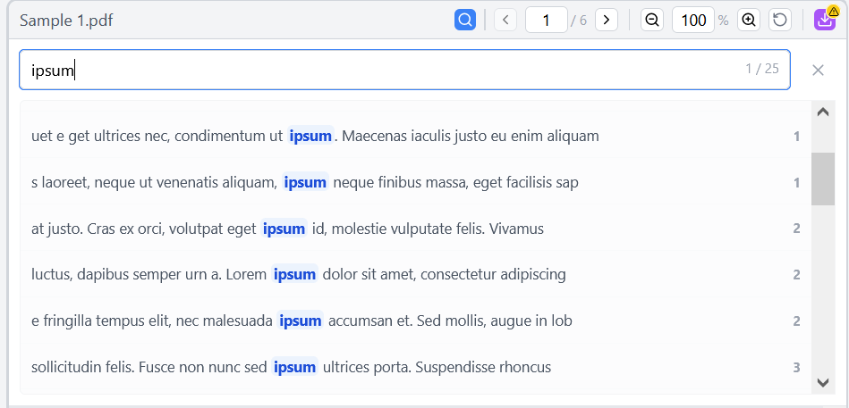

#  PDFTwice


**PDFTwice** is a minimalist web tool for side-by-side PDF review. It is designed for QC and comparison of different versions of PDFs, like v1 vs v2, or translations.
Unlike diff viewers, it is not focused on finding and highlighting differences. It provides an unencumbered view of both PDFs. You can try it [here](https://pluskitty.github.io/PDFTwice)!

## 🚀 Features

*   **Dual View**: See two PDFs side-by-side for easy comparison.
*   **Sync View**: Sync scrolling, page navigation, and zoom between both documents for parallel review.
*   **Search**: Locate text within each document instantly. See all instances of the text with context and page numbers, and click on an instance to go to its location.
*   **Session Recovery**: Comments and session state are automatically saved to local storage, and restored if you close the tab without saving.
*   **Privacy**: **100% Client-Side**. Your PDFs are processed entirely in your browser. No files are ever sent to a server.
*   **Secure Local Bridge**: When self-hosted, securely load local files via URL parameters (e.g., `?left=ver1.pdf&right=ver2.pdf`) with built-in path traversal protection.
*   **URL-based loading**: Load remote PDFs directly via URL (e.g., `?left=https://example.com/doc.pdf`). Demo: [here](https://pluskitty.github.io/PDFTwice/?left=https://ontheline.trincoll.edu/images/bookdown/sample-local-pdf.pdf&right=https://pdfobject.com/pdf/sample.pdf) *Note: Requires CORS support on the remote server.*
*   **Comment & Export**:
    *   **Double-click** anywhere to add a sticky note.
    *   **Select text** to add a highlighted comment.
    *   **Edit & Remove** existing comments.
    *   **Custom Author**: Set and persist your display name for new comments.
    *   **One-Click Export**: Download the PDF with annotations.
*   **Open source**: This is a flexible, lean tool that can be easily integrated into existing workflows. E.g. auto-generate comparison views for QC processes, add buttons for specific DB actions, autosave to specific paths with preset naming patterns, etc.
	




## 📦 Getting Started

### Prerequisites

*   [Node.js](https://nodejs.org/) (v16 or higher)

### Installation

1.  Clone the repository:
    ```bash
    git clone https://github.com/PlusKitty/PDFTwice.git
    cd PDFTwice/app
    ```
2.  Install dependencies:
    ```bash
    npm install
    ```

### Running Locally

```bash
npm run dev
```

The app will be available at `http://localhost:5173`.

## Professional Workflow (URL Parameters)

You can load PDFs automatically by passing `left` and `right` URL parameters:
`http://localhost:5173/?left=file1.pdf&right=file2.pdf`

> [!NOTE]
> For security, the application can only automatically load files from the `app/public/samples` directory when running through the local development server.

## Deployment

Since this is a client-side React application, it can be hosted on:
*   [GitHub Pages](https://pages.github.com/)
*   [Vercel](https://vercel.com/)
*   [Netlify](https://www.netlify.com/)

**Note**: The "Local Bridge" feature for loading arbitrary local paths from your hard drive is only available when running the Vite development server locally.

## License

This project is licensed under the **GNU Affero General Public License v3.0 (AGPLv3)**.

*   **Free to Use**: You can use this software for personal or internal purposes.
*   **Open Source**: You can modify and distribute the code.
*   **Copyleft**: If you modify this software and distribute it (or host it as a SaaS), you **must** release your source code under the same license.

See the [LICENSE](LICENSE) file for details.
